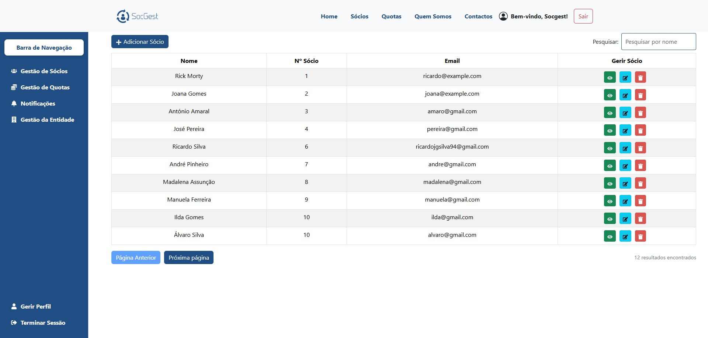
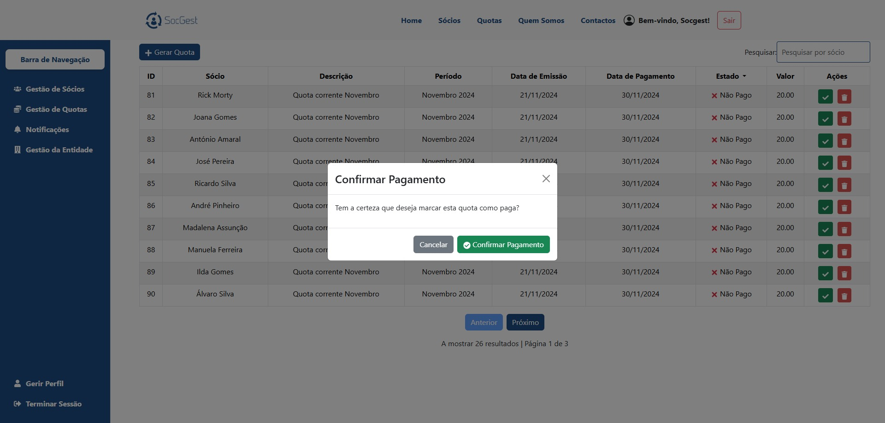
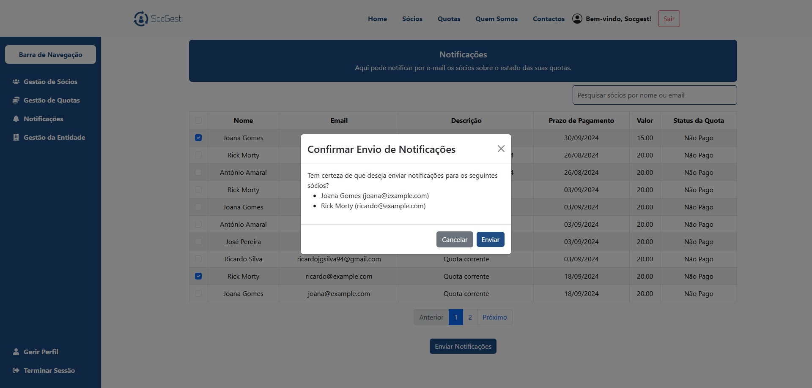

## Descrição do Projeto

Este é o frontend do projeto Socgest, desenvolvido em React.

## Pré-requisitos

- Node.js (>= 14.x)
- NPM (Node Package Manager)
- IDE (recomendado: Visual Studio Code)

## Configuração do Projeto

1. Abra o terminal no diretório do projeto
2. Execute o comando 'npm install' para instalar todas as dependências necessárias
3. Execute o comando 'npm start' para iniciar o servidor de desenvolvimento

## Alguns ecrãs do Projeto
- Homepage

- Ecrã de Gestão de Sócios

- Modal de Edição de Sócio

- Ecrã de Gestão de Quotas

- Modal de Emissão de Quotas

- Ecrã de Envio de Notificações

- Análises: Estado dos Sócios

- Análises: Estado das Quotas

- Análises: Top 10 Devedores

